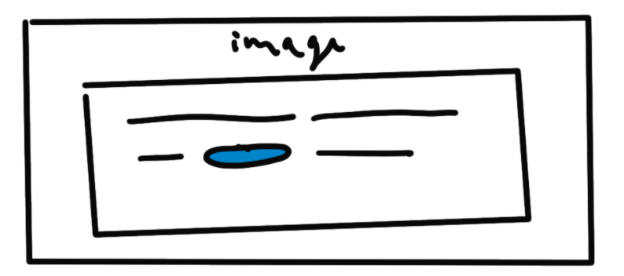

# Ada Front End Test - Trevor Coleman

App that pulls data from a simple REST api and displays data in content blocks.

## Getting Started:

###Installation

##### 1. Clone this repo:

`git clone git@github.com:trevor-coleman/tc-ada-fe-test.git`

##### 2. Open the project directory:

`cd tc-ada-fe-test`

##### 3. Run the server:

* `yarn start-server`, or 
* `npm run start-server`

##### 3. Run the react app:

* `yarn start` or,
* `npm run start`


## Assumptions

### General

#### Packages

I chose `redux` with `redux-toolkit` to manage my application state. I am 
most comfortable working in redux, and I find it has great abstractions and 
patterns that make it easy to manage as projects grow in complexity. Redux 
toolkit is a huge time-saver and greatly cuts down on boilerplate code. 

I used `create-react-app` to get started because it let me get up and running
quickly, and it uses a number of sensible defaults.

I used the `material-ui` component library, as it brings consistency to the ui 
and lets me get working on the functionality right away. I really like the way 
it handles styling for components, and I like that you can import individual 
components one-at-a-time to help manage bundle bloat. 

I chose `axios` to handle my data fetching. I have used it a number of times
and I find that it has a really nice clean api. 

### Challenge 1

#### Image Component

In the provided sketch, the "image" component looked like this:


But the content element only contained a url:

```
{
  "type": "image",
"url": "http://vignette.wikia.nocookie.net/memoryalpha/images/4/4f/Data%2C_2366.jpg/revision/latest?cb=20130529102644&path-prefix=en"
}
``` 
 As this app is really only displaying data and not editing it, I chose to just 
 render the image inline. If the user was going to be editing data with this,
 it would make more sense to display the URL with a thumbnail preview, or a 
 drag-and-drop image replacement component, or something similar. 

#### Empty Text Blocks

The spec didn't discuss how to handle displaying text elements with empty bodies. 


I chose to display a "no content" message, that I visually distinguished. That
way the user would be clear it was a system message and not the content 
of the block.

#### Handling large numbers of results

This API only contains a small number of nodes. In a real-world application
we may need to handle queries that would generate hundreds, or thousands of
results. In that case, I would implement some kind of pagination -- requesting
only as many results as can be retrieved quickly and displayed without slowing
the app down.

The list of nodes in the sidebar could use an "endless scroll" and fetch more
results when the user nears or reaches the end of the list.

#### Tree Diagram in the sidebar

The spec showed lines connecting subnodes in the sidebar in a tree diagram. 


I was able to accomplish the desired effect using pseudoelements in css, but I'm
not really happy with how they look.


If this was going to actual customers I would probably want to spend a bit more 
time to try and tidy this up a bit. Specifically I'd want to add some rounding 
to the elbow of the last-child connector. But doing that would have required 
starting over and trying an entirely different approach, which seemed excessive
for this exercise.  

### Challenge 2

#### Displaying search results

The challenge says to:

>Build an interactive frontend component that works with the /search end point and displays results as outlined in the design documents.

I took this to mean only displaying nodes in the sidebar that were included in
the `/search` response.

I applied the same filtering to subtrees as well, only displaying those that 
matched the results.

#### Highlighting Search Results

The challenge says:

> In the detail view, make sure to **highlight** the search terms in the text if it's in the answer's content.

It's unclear if the word highlight there is bolded for emphasis, or whether 
that's meant to show how the text should be highlighted.

For greater visibility I chose to apply a highlight effect to the text. 
Though this is trivial to change.


I also applied the highlighting to matches in the sidebar. 


#### XSS Scripting Protection

To deal with this issue I used regex to match the search string, and then
rendered each component as a span component. This let me take advantage of 
react's built-in string-escaping.

I created a component that takes a 'body' prop and a 'stringToHighlight' prop
and then renders a set of spans appropriately highlighted. I liked this because
it is reusable. If I had unlimited time for this, and it was going to production
I would like to build it to take optional "highlight" and  "regular" component 
props so you could replace the default wrapper spans with anything you wanted.


#### Data persistence
To improve the user experience, I would probably find a way to make the state 
store persistent on the user side. I've previously used `redux-persist` for this.
It greatly improves first-load times, and can persist state through refreshes
which is useful.

Also in this version I only fetch a node once -- the first time it is accessed. 
This saves on fetching, but if the data was expected to change frequently, I 
might fetch it every time, to make sure it's up to date. 

A compromise solution would be storing a timestamp with the data when it is 
fetched and then only re-fetching if the data is older than some set amount. 

I suppose if you wanted to be very fancy and worked at a company with infinite 
time and money, you could build a system that would track how often those 
things changed, and then estimate appropriate "best before" dates to optimize 
for some balance of consistency and efficiency. 

#### Routing
I'd use `react-router` to add routes to the application, which would allow users 
to access particular nodes via the url. Like `/node/:id` to open a particular
node.

### Challenge 3

#### Variable pill down-caret icon

The variable pill is displayed like this in the spec:


The down-caret icon is strongly suggestive of some kind of interactive functionality.
In a real-world application that should probably show for a dropdown menu when 
clicked, that would list the other variables that could be substituted there.
 
I didn't implement that here because this app seems to be mostly about displaying
data, and even if I built it, there was no API endpoint to accept the change.
 
If this was an editing app, then I'd probably write an express endpoint to allow
for variable substitution -- (or ask the backend team? Depending on the division of
labour.) 

Once that endpoint was in place I'd build out the dropdown menu. Or if that 
wasn't possible I'd at least remove the caret, to stop users from clicking and 
being disappointed.

If this was shipping to actual customers I wouldn't ship this component in this 
state. I'd talk to whoever designed this and resolve the ambiguity before 
pushing it out because you can't have interaction cues that do nothing if you 
want to keep your customers.

## Possible Improvements

Given the limited scope of the exercise there are a number of things that I 
might do if this was shipping to real customers that I haven't done here:

### App should be responsive
The current application is built for display on a medium-to-large display, but 
most users these days expect to be able to access everything on their phone.

In mobile contexts I would hide the drawer, by adding a title bar with a 
hamburger menu icon. I'd show the list of nodes by default, and then tapping on 
a node would open the detail view in full screen. Basically the same as it is 
here, just scaled down. The user could then tap a back button on the title bar 
to return the node list.

On larger, but still compact screens (ipad etc.) I'd keep this as it is, but 
allow the user to dismiss the node list if they wanted.

### Accessibility
To improve accesibility, I'd want to do a thorough check to make sure all 
components had proper aria-labels for people with screen-readers.


`Material-UI` is nice in that it provides a built in `theme.getContrastText()`
method which will provide text with sufficient context to prevent readability
errors on background colours. This app is largely black-and-white so it isn't 
an issue. But in a production app with a proper designer, you'd want to be sure.

 


